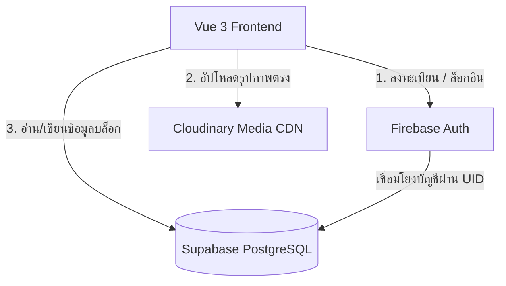
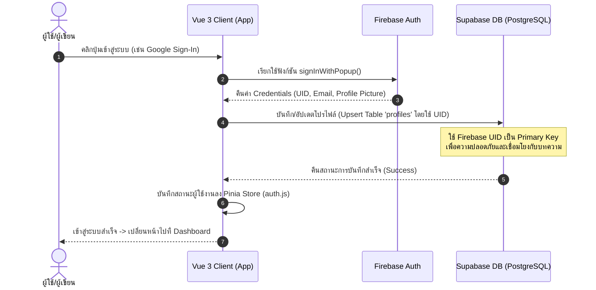
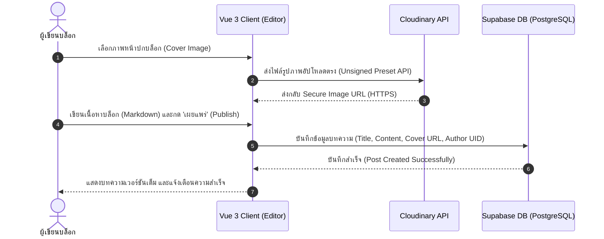
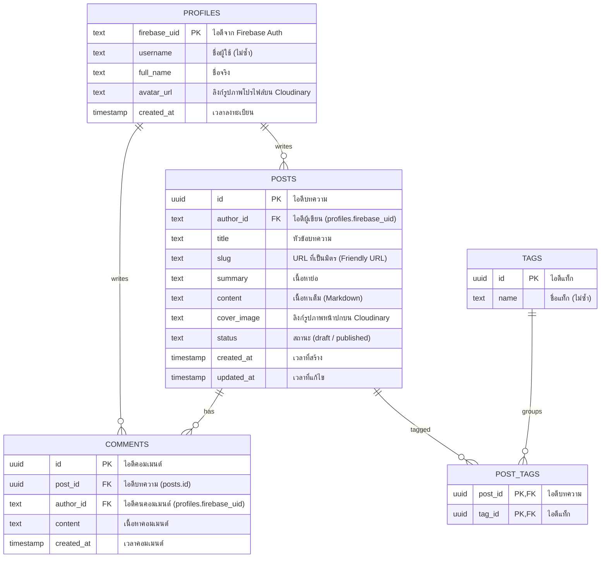

# ✍️ Premium Blog System (Vue 3 + Firebase + Supabase + Cloudinary)

ระบบบล็อกสไตล์มินิมอลที่มีลูกเล่นระดับพรีเมียม (Glassmorphism & Micro-animations) พัฒนาขึ้นโดยสถาปัตยกรรมแบบผสมผสาน (Hybrid Serverless Architecture) เพื่อดึงประสิทธิภาพสูงสุดของแต่ละแพลตฟอร์มออกมาใช้งานร่วมกัน

---

## 🏗️ สถาปัตยกรรมและเทคโนโลยีที่ใช้ (Architecture & Tech Stack)

ระบบนี้ขับเคลื่อนด้วยการประสานงานของ 4 เทคโนโลยีหลัก:



*   **Frontend**: **Vue 3 (Composition API)** พัฒนาด้วยความรวดเร็วบน **Vite** พร้อมจัดการสเตทด้วย **Pinia** และจัดการเส้นทางด้วย **Vue Router**
*   **Authentication**: **Firebase Auth** (จัดการล็อกอินผ่าน Email/Password และ Google Sign-In) มีความปลอดภัยและเสถียรภาพสูง
*   **Database**: **Supabase (PostgreSQL)** จัดเก็บข้อมูลที่มีความสัมพันธ์แบบ Relational (บทความ, คอมเมนต์, แท็ก, และข้อมูลโปรไฟล์)
*   **Media Hosting**: **Cloudinary** จัดการจัดเก็บรูปภาพหน้าปกและรูปโปรไฟล์ผู้ใช้ พร้อมลดขนาดและแปลงไฟล์ภาพให้เหมาะสมกับอุปกรณ์ใช้งานโดยอัตโนมัติ (Dynamic Optimization)
*   **Styling & Motion**: **Vanilla CSS** (CSS Variables & CSS Nesting) ร่วมกับ **@vueuse/motion** สำหรับการสร้างดีไซน์ Glassmorphism และ Micro-animations ที่ลื่นไหล

---

## 📊 ลำดับขั้นตอนการทำงาน (System Flows & Sequence Diagrams)

การทำงานของระบบบล็อกนี้แบ่งออกเป็น 2 Flow สำคัญ ได้แก่ ระบบการระบุตัวตน (Authentication) และระบบการเขียนบทความ (Content Creation) ดังนี้:

### 1. ลำดับขั้นตอนการ Login & Sync User Profile
ขั้นตอนเมื่อผู้ใช้อัปเดตและซิงค์ข้อมูลบัญชีระหว่าง Firebase Auth และ Supabase:



### 2. ลำดับขั้นตอนการอัปโหลดรูปภาพและการเขียนบทความ
ขั้นตอนเมื่อผู้เขียนบล็อกอัปโหลดรูปภาพหน้าปกตรงไปยัง Cloudinary และเขียนเนื้อหาลงฐานข้อมูล Supabase:



---

## ✨ คุณสมบัติเด่น (Key Features)

*   **⚡ High Performance**: หน้าเว็บโหลดรูปภาพรวดเร็วมากจาก Cloudinary CDN พร้อมโค้ด Vue 3 ที่ผ่านการบิลด์ด้วย Vite
*   **🔐 Secure Multi-Auth**: ล็อกอินและจัดการสิทธิ์การเข้าใช้งานด้วย Firebase Auth (Email/Password, Google Sign-In)
*   **📝 Markdown Editor**: เขียนและแก้ไขบทความในรูปแบบ Markdown พร้อมระบบ Live Preview และระบบอัปโหลดภาพประกอบตรงไปยัง Cloudinary
*   **💬 Real-time Comments & Interaction**: ระบบคอมเมนต์ใต้บทความแบบเรียลไทม์ผ่านการเชื่อมโยงข้อมูลใน Supabase
*   **🌓 Smooth Dark/Light Mode**: สลับธีมสว่างและมืดได้นุ่มนวล พร้อมบันทึกสถานะธีมของผู้ใช้โดยอัตโนมัติ

---

## 🔑 ระบบล็อกอินและจัดการสิทธิ์การเข้าใช้งาน (Login & Auth System)

ระบบลงทะเบียนและเข้าสู่ระบบในโปรเจกต์นี้ได้รับการพัฒนาโดยการผสานการทำงานร่วมกันระหว่าง **Firebase Auth** และ **Supabase PostgreSQL** เพื่อความปลอดภัยและรวดเร็วสูงสุด:

1. **การลงทะเบียนและเข้าสู่ระบบ (Multi-Provider Authentication)**
   *   **Email & Password**: ลงทะเบียนด้วยอีเมลมาตรฐาน พร้อมระบบความปลอดภัยและการตรวจสอบความแข็งแกร่งของรหัสผ่าน
   -   **Google OAuth (Social Login)**: บริการล็อกอินผ่านบัญชี Google เพียงคลิกเดียว สะดวก ปลอดภัย และลดขั้นตอนการกรอกข้อมูล
   -   **Password Recovery**: ระบบส่งอีเมลสำหรับรีเซ็ตรหัสผ่านหากผู้ใช้งานลืมรหัสผ่าน
2. **การเชื่อมโยงและซิงค์ข้อมูลโปรไฟล์ (User Profile Syncing)**
   *   ทันทีที่ผู้ใช้ลงทะเบียนหรือล็อกอินสำเร็จเป็นครั้งแรก ระบบจะนำค่ารหัสผู้ใช้ (`uid`) จาก Firebase ไปเขียนและสร้างแถวข้อมูลใหม่ในตาราง `profiles` บนฐานข้อมูล Supabase เพื่อใช้จัดเก็บข้อมูลเพิ่มเติม เช่น ชื่อจริง รูปโปรไฟล์ และเป็นตัวระบุเพื่อสร้างบทความ/เขียนความคิดเห็นต่อไป
3. **การรักษาความปลอดภัยของหน้าเว็บ (Route Guard & Security)**
   *   **Navigation Guard**: ป้องกันการเข้าถึง URL หน้าหลังบ้าน เช่น หน้าเขียนบทความ (`EditorView.vue`) และหน้าแดชบอร์ด (`DashboardView.vue`) โดยสแกนหา Token การล็อกอินจาก Firebase Auth เสมอ หากไม่มีการล็อกอิน ระบบจะเด้งผู้ใช้งานกลับไปที่หน้าล็อกอินโดยอัตโนมัติ
   *   **Supabase Row Level Security (RLS)**: ป้องกันไม่ให้บุคคลภายนอกแก้ไขโพสต์หรือแทรกคอมเมนต์แทนผู้อื่น โดยตรวจสอบสิทธิ์เทียบกับ UID จาก Firebase
4. **UI/UX ระดับพรีเมียม (Interactive Login UI)**
   *   หน้าจอการกรอกข้อมูลที่มี Dynamic Validation คอยแจ้งเตือนการกรอกอีเมลผิดรูปแบบ หรือรหัสผ่านสั้นเกินไปก่อนที่จะกดยืนยัน
   *   แสดง Loading states ด้วยเอฟเฟกต์ Glassmorphism สวยงาม เพื่อให้ผู้ใช้งานทราบสถานะการสื่อสารกับ Server

### 📋 ขอบเขตการทำงานของระบบ Login (Scope of Login Features)

เพื่อระบุขอบเขตการพัฒนาที่ชัดเจน ระบบระบุตัวตนได้รับการกำหนดขอบเขตออกเป็นสองส่วนดังนี้:

**✅ สิ่งที่ระบบรองรับ (In-Scope)**
*   **Authentication & Registration**: รองรับการลงทะเบียนและเข้าสู่ระบบด้วย Email/Password และ Google Account (OAuth)
*   **Password Reset**: รองรับการส่งลิงก์เพื่อรีเซ็ตรหัสผ่านไปยังอีเมลกรณีที่ผู้ใช้งานลืมรหัสผ่าน
*   **Session State**: ระบบจดจำเซสชันการล็อกอินของผู้ใช้ใน Local Client (ไม่เด้งออกเมื่อผู้ใช้ปิดหน้าจอหรือเปิดแท็บใหม่)
*   **Automatic Profile Binding**: ทุกไอดีที่ลงทะเบียนผ่าน Firebase จะเชื่อมโยงข้อมูลโปรไฟล์โดยอัตโนมัติลงบนตาราง `profiles` ใน Supabase PostgreSQL
*   **Route Protection**: บล็อกการเข้าถึงหน้าที่จำกัดเฉพาะผู้ล็อกอิน (หน้า Editor และ หน้า Dashboard)
*   **Client Validation**: ระบบตรวจสอบความถูกต้องของฟอร์ม (อีเมลและรหัสผ่าน) ฝั่ง Client ก่อนส่งคำขอไปยังระบบ Auth

**❌ สิ่งที่ไม่รองรับในเฟสแรก (Out-of-Scope)**
*   **Other Social Providers**: การเข้าสู่ระบบด้วยบริการอื่นๆ เช่น Facebook, Twitter, GitHub, หรือ Apple Sign-In
*   **Granular Role Management (RBAC)**: ระบบจำกัดสิทธิ์ผู้ใช้แบบซับซ้อน เช่น การแบ่งกลุ่มสิทธิ์เป็น Super Admin, Editors, Contributors (ในรุ่นนี้ ผู้ที่ล็อกอินทั้งหมดจะมีสิทธิ์เท่าเทียมกันในการเขียนและแก้ไขบล็อกส่วนตัวของตนเอง)
*   **Two-Factor Authentication (2FA)**: ระบบยืนยันตัวตนแบบสองขั้นตอนผ่าน OTP หรือแอปพลิเคชัน Authenicator
*   **Session Idle Timeout**: ระบบจับเวลารับรู้ความเงียบหาย (Idle) เพื่อเตะผู้ใช้งานออกจากระบบโดยอัตโนมัติเมื่อไม่มีการขยับเมาส์

---

## 📂 โครงสร้างโปรเจกต์ (Project Structure)

```text
src/
├── assets/          # ไฟล์สไตล์และฟอนต์หลัก
│   └── main.css     # CSS Variables & Global Style (ธีมระบบ)
├── components/      # คอมโพเนนต์ที่นำกลับมาใช้ใหม่ได้
│   ├── BlogCard.vue
│   ├── CommentSection.vue
│   ├── Navbar.vue
│   └── Footer.vue
├── views/           # หน้าจอหลัก (Pages)
│   ├── HomeView.vue        # หน้าแรกแสดงรายการบล็อก
│   ├── PostDetailView.vue  # หน้าอ่านบทความฉบับเต็ม
│   ├── DashboardView.vue   # แดชบอร์ดจัดการบทความของผู้แต่ง
│   ├── EditorView.vue      # หน้าเขียนและแก้ไขบทความ
│   └── LoginView.vue       # หน้าเข้าสู่ระบบและสมัครสมาชิก
├── router/          # การนำทางหน้าเว็บ (Vue Router)
├── stores/          # การจัดการ State กลาง (Pinia)
│   ├── auth.js      # จัดเก็บข้อมูลล็อกอินจาก Firebase & เชื่อมโยงกับโปรไฟล์ใน Supabase
│   └── theme.js     # จัดการธีมสว่างและมืด
├── services/        # ตัวเชื่อมโยงกับบริการภายนอก (External APIs)
│   ├── firebase.js      # คอนฟิกและสิทธิ์การใช้งาน Firebase Auth
│   ├── supabase.js      # ตัวเชื่อมต่อไปยังฐานข้อมูล Supabase
│   └── cloudinary.js    # ฟังก์ชันสำหรับส่งไฟล์ภาพไปยัง Cloudinary
├── App.vue          # Root component ของโปรเจกต์
└── main.js          # จุดเริ่มต้นแอปพลิเคชัน
```

---

## 🗄️ โครงสร้างข้อมูล (Database Structure & Schema)

ความสัมพันธ์ของข้อมูลทั้งหมดในฐานข้อมูล Supabase (PostgreSQL) แสดงผ่าน ER Diagram และรายละเอียดโครงสร้างตารางดังนี้:

### 1. แผนภาพความสัมพันธ์ข้อมูล (ER Diagram)



---

## ⚙️ การเริ่มต้นติดตั้ง (Getting Started)

### 1. ติดตั้ง Dependencies และโคลนโปรเจกต์
```bash
# โคลนโปรเจกต์ลงมาในเครื่อง
git clone <repository-url>
cd my_blog

# ติดตั้งไลบรารีทั้งหมด
npm install
```

### 2. ตั้งค่าตัวแปรสภาพแวดล้อม (Environment Variables)
สร้างไฟล์ `.env` ไว้ที่โฟลเดอร์หลัก (Root) ของโปรเจกต์ และกรอกค่าดังนี้:
```env
# Firebase configuration
VITE_FIREBASE_API_KEY=your_firebase_api_key
VITE_FIREBASE_AUTH_DOMAIN=your_firebase_auth_domain
VITE_FIREBASE_PROJECT_ID=your_firebase_project_id
VITE_FIREBASE_STORAGE_BUCKET=your_firebase_storage_bucket
VITE_FIREBASE_MESSAGING_SENDER_ID=your_firebase_messaging_sender_id
VITE_FIREBASE_APP_ID=your_firebase_app_id

# Supabase configuration
VITE_SUPABASE_URL=your_supabase_url
VITE_SUPABASE_ANON_KEY=your_supabase_anon_key

# Cloudinary configuration
VITE_CLOUDINARY_CLOUD_NAME=your_cloudinary_cloud_name
VITE_CLOUDINARY_UPLOAD_PRESET=your_cloudinary_unsigned_preset
```

### 3. รันโปรเจกต์สำหรับการพัฒนา (Development)
```bash
npm run dev
```
ระบบจะรันขึ้นที่ `http://localhost:5173`

---

## 🗄️ การจัดเตรียม Database & Services

### 1. Supabase (Database Schema Setup)
รันคำสั่ง SQL ต่อไปนี้ในช่อง **SQL Editor** ของ Supabase เพื่อสร้างตารางที่จำเป็น:

```sql
-- 1. สร้างตารางโปรไฟล์สำหรับเชื่อมกับ Firebase UID
create table profiles (
  firebase_uid text primary key,
  username text unique not null,
  full_name text,
  avatar_url text,
  created_at timestamp with time zone default timezone('utc'::text, now()) not null
);

-- 2. สร้างตารางสำหรับบทความบล็อก
create table posts (
  id uuid default gen_random_uuid() primary key,
  author_id text references profiles(firebase_uid) on delete cascade not null,
  title text not null,
  slug text unique not null,
  summary text,
  content text not null,
  cover_image text,
  status text default 'draft' check (status in ('draft', 'published')),
  created_at timestamp with time zone default timezone('utc'::text, now()) not null,
  updated_at timestamp with time zone default timezone('utc'::text, now()) not null
);

-- 3. สร้างตารางสำหรับคอมเมนต์ใต้บทความ
create table comments (
  id uuid default gen_random_uuid() primary key,
  post_id uuid references posts(id) on delete cascade not null,
  author_id text references profiles(firebase_uid) on delete cascade not null,
  content text not null,
  created_at timestamp with time zone default timezone('utc'::text, now()) not null
);
```

### 2. Cloudinary (Unsigned Upload Preset)
*   สมัครบัญชีและเข้าสู่หน้า Cloudinary Dashboard
*   ไปที่ **Settings (ฟันเฟือง)** > **Upload**
*   เลื่อนลงไปที่หัวข้อ **Upload presets** แล้วคลิก **Add upload preset**
*   ตั้งค่า **Signing Mode** ให้เป็น **Unsigned** เพื่อให้ฝั่งเบราว์เซอร์อัปโหลดขึ้น Cloudinary ได้โดยตรงผ่าน URL API
*   คัดลอก **Cloud Name** และ **Preset Name** ไปใส่ใน `.env`