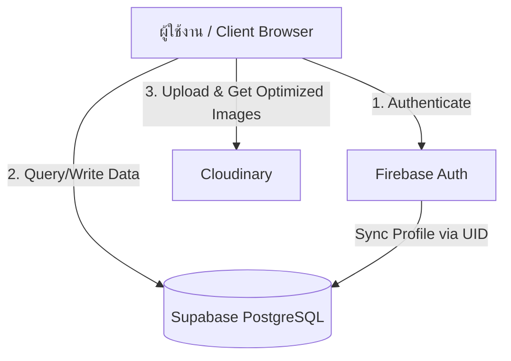

# 📝 Project Info: Vue.js + Supabase + Firebase + Cloudinary Blog System

เอกสารนี้ระบุรายละเอียดของ Tech Stack ผสมผสาน (Hybrid architecture), โครงสร้างฐานข้อมูล (Database Schema), ฟีเจอร์หลัก และโครงสร้างโปรเจกต์สำหรับระบบ Blog ที่พัฒนาด้วย **Vue 3 + Supabase + Firebase + Cloudinary**

---

## 🚀 1. Hybrid Tech Stack & Architecture

การรวมเอาสามบริการยักษ์ใหญ่ (Supabase, Firebase, Cloudinary) มาร่วมกัน จะช่วยดึงจุดเด่นของแต่ละแพลตฟอร์มออกมาใช้อย่างเต็มประสิทธิภาพ:



| บริการ/ส่วนงาน | เครื่องมือที่เลือกใช้ | บทบาทในระบบ (Role) |
| :--- | :--- | :--- |
| **Core Frontend** | **Vue 3 (Composition API) + Vite** | พัฒนาฝั่งหน้าบ้านด้วยความเร็วสูง ใช้ `<script setup>` |
| **Authentication** | **Firebase Auth** | จัดการการสมัครสมาชิก/ล็อกอิน (Email/Password, Google Sign-in) เนื่องจาก Firebase Auth มี SDK ที่เสถียรและจัดการ Social Auth ได้ง่ายมาก |
| **Database** | **Supabase (PostgreSQL)** | เก็บข้อมูลโครงสร้างหลักทั้งหมดของบล็อก (Posts, Comments, Tags, Profiles) โดยดึงพลังของ PostgreSQL เช่น Relation, Foreign Keys และ View มาใช้ |
| **Media & Images** | **Cloudinary** | จัดการรูปภาพหน้าปกบล็อกและรูปโปรไฟล์ผู้ใช้ ช่วยย่อขนาด แปลงประเภทไฟล์อัตโนมัติ (WebP/AVIF) และทำ CDN เพื่อให้บล็อกโหลดรูปภาพได้รวดเร็วที่สุด |
| **State Management** | **Pinia** | จัดการสิทธิ์การเข้าใช้งานของผู้ใช้ (Auth State จาก Firebase) และตั้งค่าต่างๆ |
| **Routing** | **Vue Router** | นำทางไปยังหน้าต่างๆ พร้อมระบบ Navigation Guard เพื่อป้องกันไม่ให้ผู้ไม่ได้ล็อกอินเข้าหน้าเขียนบล็อก |
| **Libraries เสริม** | `marked`, `dompurify`, `lucide-vue-next`, `@vueuse/motion` | ใช้สำหรับแสดงผล Markdown, ตกแต่ง UI, ป้องกัน XSS และทำแอนิเมชันให้ดูพรีเมียม |

---

## 🗄️ 2. Database Schema (Supabase / PostgreSQL)

โครงสร้างฐานข้อมูลใน Supabase จะถูกเชื่อมโยงผ่าน `uid` ของผู้ใช้งานที่ได้มาจาก Firebase Authentication:

### 1) ตาราง `profiles` (เก็บข้อมูลโปรไฟล์ผู้เขียน โดยใช้ `firebase_uid` เป็น Primary Key)
```sql
create table profiles (
  firebase_uid text primary key, -- ไอดีผู้ใช้จาก Firebase Auth
  username text unique not null,
  full_name text,
  avatar_url text, -- URL รูปภาพที่เก็บไว้บน Cloudinary
  created_at timestamp with time zone default timezone('utc'::text, now()) not null
);
```

### 2) ตาราง `posts` (ตารางเก็บเนื้อหาบล็อก)
```sql
create table posts (
  id uuid default gen_random_uuid() primary key,
  author_id text references profiles(firebase_uid) on delete cascade not null,
  title text not null,
  slug text unique not null,
  summary text,
  content text not null, -- เนื้อหา Markdown
  cover_image text, -- URL รูปภาพหน้าปกที่เก็บไว้บน Cloudinary
  status text default 'draft' check (status in ('draft', 'published')),
  created_at timestamp with time zone default timezone('utc'::text, now()) not null,
  updated_at timestamp with time zone default timezone('utc'::text, now()) not null
);
```

### 3) ตาราง `comments` (ระบบความคิดเห็นใต้บทความ)
```sql
create table comments (
  id uuid default gen_random_uuid() primary key,
  post_id uuid references posts(id) on delete cascade not null,
  author_id text references profiles(firebase_uid) on delete cascade not null,
  content text not null,
  created_at timestamp with time zone default timezone('utc'::text, now()) not null
);
```

### 4) ตาราง `tags` และ `post_tags` (สำหรับหมวดหมู่บทความ)
```sql
create table tags (
  id uuid default gen_random_uuid() primary key,
  name text unique not null
);

create table post_tags (
  post_id uuid references posts(id) on delete cascade,
  tag_id uuid references tags(id) on delete cascade,
  primary key (post_id, tag_id)
);
```

---

## 🔑 3. Login & Authentication Features (ระบบระบุตัวตนและสิทธิ์เข้าถึง)

ระบบล็อกอินและการระบุตัวตนในโปรเจกต์นี้ใช้การทำงานร่วมกันระหว่าง **Firebase Auth** และ **Supabase Database** โดยมีฟีเจอร์และคุณลักษณะเด่นดังนี้:

1. **Multi-Provider Authentication**:
   - **Email/Password**: รองรับการลงทะเบียนและเข้าสู่ระบบด้วยอีเมลและรหัสผ่านแบบมาตรฐาน พร้อมระบบตรวจสอบความแข็งแกร่งของรหัสผ่าน
   - **Google Sign-In**: ระบบล็อกอินแบบคลิกเดียว (Single Sign-On) ผ่าน Google SDK ที่ปลอดภัยและสะดวกสบาย
2. **User Profile Syncing**:
   - เมื่อผู้ใช้ทำการลงทะเบียนหรือเข้าสู่ระบบเป็นครั้งแรก ระบบจะนำรหัส `uid` จาก Firebase ไปสร้างข้อมูลโปรไฟล์ใหม่ในตาราง `profiles` ของ Supabase (เก็บชื่อ, อีเมล, รูปโปรไฟล์เริ่มต้น) ทำให้การเก็บข้อมูลบทความมีความเป็นระเบียบและอ้างอิงกับตัวตนผู้แต่งได้ถูกต้อง
3. **Session Persistence**:
   - บันทึกเซสชันการล็อกอินอย่างถาวรในเบราว์เซอร์ผ่าน Firebase Auth SDK ผู้ใช้ไม่ต้องเข้าสู่ระบบซ้ำเมื่อเปิดแท็บใหม่หรือรีเฟรชหน้าเว็บ
4. **Route Protection (Vue Router Navigation Guards)**:
   - ตรวจสอบสิทธิ์การเข้าถึงหน้าเว็บ (Authentication Guards) เช่น ป้องกันไม่ให้ผู้ใช้ทั่วไปที่ไม่ได้ล็อกอินเข้าถึงหน้าเขียนบทความ (`EditorView.vue`) หรือแดชบอร์ดส่วนตัว (`DashboardView.vue`) และจะเด้งกลับไปหน้า Login อัตโนมัติ
5. **Interactive UI/UX**:
   - ฟอร์มการกรอกข้อมูลมาพร้อมกับการตรวจสอบความถูกต้อง (Form Validation) เช่น รูปแบบอีเมล ความยาวรหัสผ่าน
   - การแสดงสถานะการโหลดข้อมูล (Loading State) ด้วย Animation ที่สวยงามลื่นไหล
   - ระบบกู้คืนรหัสผ่าน (Password Reset) ส่งลิงก์รีเซ็ตรหัสผ่านไปยังอีเมลผู้ใช้

---

## 🖼️ 4. Cloudinary Integration Workflow

การจัดการรูปภาพประกอบบทความจะทำงานผ่านขั้นตอนดังนี้:
1. ผู้เขียนอัปโหลดรูปภาพผ่านหน้าเขียนบล็อก (Editor)
2. Frontend ทำการอัปโหลดไฟล์ตรงไปยัง **Cloudinary** (โดยใช้ Cloudinary Upload Presets แบบ Unsigned อัปโหลดตรงจากเบราว์เซอร์อย่างปลอดภัย)
3. Cloudinary จะทำการประมวลผลรูปภาพ (ย่อขนาด, บีบอัดไฟล์) และส่งผลลัพธ์เป็น Image URL กลับมายัง Vue.js
4. Vue.js นำ Image URL ที่ได้ไปบันทึกเก็บไว้ในฐานข้อมูล **Supabase** ร่วมกับเนื้อหาบล็อก
5. เมื่อแสดงผลบล็อก Vue.js สามารถดึง URL รูปภาพจาก Cloudinary มาแสดงผลได้ทันที และสามารถระบุ Parameter การ Transform เช่นการ crop หรือปรับขนาดบน URL ได้เลย เช่น:
   `https://res.cloudinary.com/demo/image/upload/w_800,c_scale/v1/sample.jpg`

---

## ⚙️ 5. Config & Keys ใน `.env`

สำหรับเชื่อมโยงบริการทั้งหมดเข้าด้วยกัน:

```env
# Firebase Configuration (ใช้ทำ Auth)
VITE_FIREBASE_API_KEY=your_firebase_api_key
VITE_FIREBASE_AUTH_DOMAIN=your_firebase_auth_domain
VITE_FIREBASE_PROJECT_ID=your_firebase_project_id
VITE_FIREBASE_STORAGE_BUCKET=your_firebase_storage_bucket
VITE_FIREBASE_MESSAGING_SENDER_ID=your_firebase_messaging_sender_id
VITE_FIREBASE_APP_ID=your_firebase_app_id

# Supabase Configuration (ใช้เก็บข้อมูล)
VITE_SUPABASE_URL=your_supabase_project_url
VITE_SUPABASE_ANON_KEY=your_supabase_anon_key

# Cloudinary Configuration (ใช้อัปโหลด/จัดการรูปภาพ)
VITE_CLOUDINARY_CLOUD_NAME=your_cloudinary_cloud_name
VITE_CLOUDINARY_UPLOAD_PRESET=your_cloudinary_upload_preset
```

---

## 📂 6. Project Structure

โครงสร้างโฟลเดอร์สำหรับจัดการหลาย SDK:

```text
src/
├── assets/
│   └── main.css
├── components/
│   ├── BlogCard.vue
│   ├── CommentSection.vue
│   └── Navbar.vue
├── views/
│   ├── HomeView.vue
│   ├── PostDetailView.vue
│   ├── EditorView.vue
│   └── LoginView.vue
├── router/
├── stores/
│   ├── auth.js          # จัดการ Auth State ของ Firebase และเชื่อมโยงข้อมูล Profile ใน Supabase
│   └── theme.js
├── services/            # แยก Service การเรียกใช้งานบริการภายนอก
│   ├── firebase.js      # เริ่มต้นใช้งาน Firebase Auth
│   ├── supabase.js      # ตัวเชื่อมต่อ Supabase Database Client
│   └── cloudinary.js    # ฟังก์ชันช่วยอัปโหลดภาพขึ้น Cloudinary
├── App.vue
└── main.js
```
